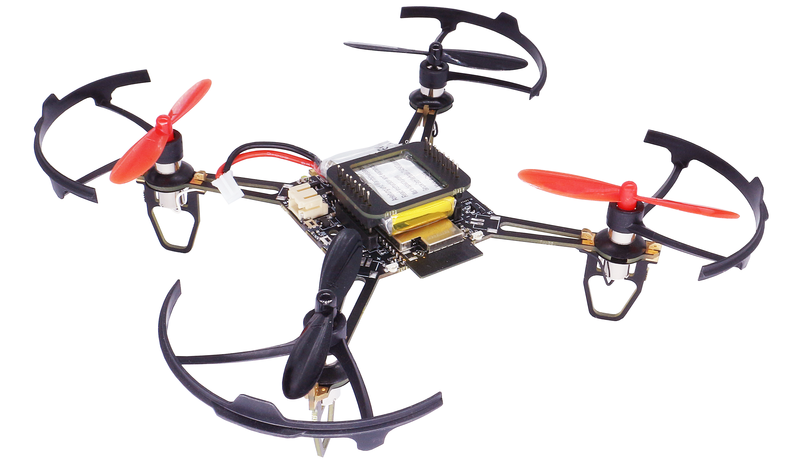
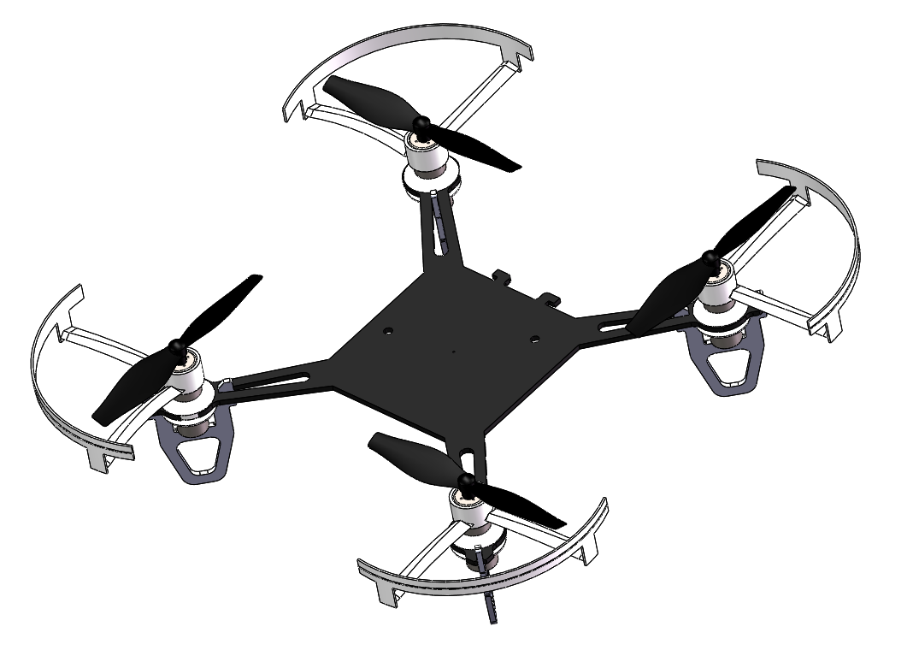
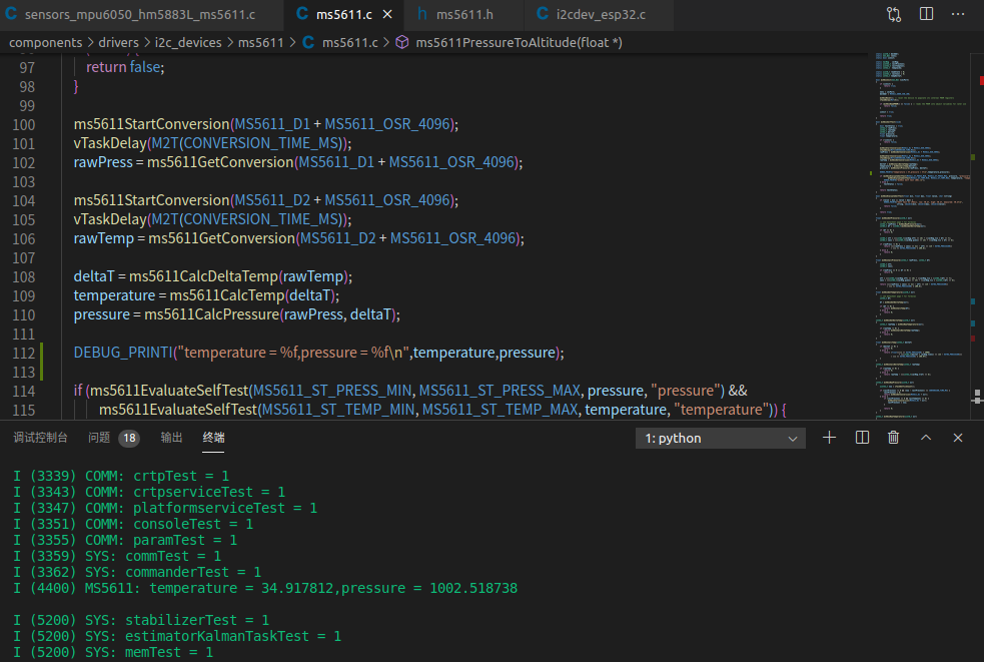

# ESP-Drone
## 简介 
本人有幸参加上海乐鑫组织的线下活动，通过两天的学习与交流逐渐掌握了ESP32-S2的环境搭建、代码编译等工作。同时，也根据自己所学专业知识，修改部分代码，以便和大家交流，欢迎留言。  

ESP-Drone 是基于乐鑫 ESP32-S2/ESP32 开发的小型无人机解决方案，可使用手机 APP 或游戏手柄通过 Wi-Fi 网络进行连接和控制。目前已支持自稳定飞行、定高飞行、定点飞行等多种模式。该方案硬件结构简单，代码架构清晰完善，方便功能扩展，可用于 STEAM 教育等领域。控制系统代码来自 Crazyflie 开源工程，使用 GPL3.0 开源协议。

## 实物图片
  

## 官方教程
* **从这里开始**: [Getting Started](https://docs.espressif.com/projects/espressif-esp-drone/zh_CN/latest/gettingstarted.html)
* **硬件原理图**：[Hardware](https://docs.espressif.com/projects/espressif-esp-drone/zh_CN/latest/_static/ESP32_S2_Drone_V1_2/SCH_Mainboard_ESP32_S2_Drone_V1_2.pdf)
* **iOS APP 源代码**: [ESP-Drone-iOS](https://github.com/EspressifApps/ESP-Drone-iOS)
* **Android APP 源代码**: [ESP-Drone-Android](https://github.com/EspressifApps/ESP-Drone-Android)  

## 开发笔记  
## 一、 3D建模
通过Solidworks(2018)绘制，方便3D打印以及导出外形图到AD
  

## 二、气压计MS5611移植与调试
- 去除宏定义  
#define SENSORS_ENABLE_PRESSURE_MS561
- 修改`i2cdevWriteReg8`函数(**官方已修改**)
```
bool i2cdevWriteReg8(I2C_Dev *dev, uint8_t devAddress, uint8_t memAddress,
                     uint16_t len, uint8_t *data)
{
    if (xSemaphoreTake(dev->isBusFreeMutex, (TickType_t)5) == pdFALSE) {
        return false;
    }

    i2c_cmd_handle_t cmd = i2c_cmd_link_create();
    i2c_master_start(cmd);
    i2c_master_write_byte(cmd, (devAddress << 1) | I2C_MASTER_WRITE, I2C_MASTER_ACK_EN);
    if(memAddress != I2CDEV_NO_MEM_ADDR)
    {
        i2c_master_write_byte(cmd, memAddress, I2C_MASTER_ACK_EN);
    }
    i2c_master_write(cmd, (uint8_t *)data, len, I2C_MASTER_ACK_EN);
    i2c_master_stop(cmd);
    esp_err_t err = i2c_master_cmd_begin(dev->def->i2cPort, cmd, (TickType_t)5);
    i2c_cmd_link_delete(cmd);

    xSemaphoreGive(dev->isBusFreeMutex);

#if defined CONFIG_I2CBUS_LOG_READWRITES

    if (!err) {
        char str[length * 5 + 1];

        for (size_t i = 0; i < length; i++) {
            sprintf(str + i * 5, "0x%s%X ", (data[i] < 0x10 ? "0" : ""), data[i]);
        }

        I2CBUS_LOG_RW("[port:%d, slave:0x%X] Write %d bytes to register 0x%X, data: %s",
                      port, devAddr, length, regAddr, str);
    }

#endif
#if defined CONFIG_I2CBUS_LOG_ERRORS
#if defined CONFIG_I2CBUS_LOG_READWRITES
    else {
#else

    if (err) {
#endif
        I2CBUS_LOGE("[port:%d, slave:0x%X] Failed to write %d bytes to__ register 0x%X, error: 0x%X",
                    port, devAddr, length, regAddr, err);
    }

#endif

    if (err == ESP_OK) {
        return TRUE;
    } else {
        return false;
    }
}
```  
- 修改`i2cdevReadReg8`函数
```  
bool i2cdevReadReg8(I2C_Dev *dev, uint8_t devAddress, uint8_t memAddress,
                    uint16_t len, uint8_t *data)
{
    if (xSemaphoreTake(dev->isBusFreeMutex, (TickType_t)5) == pdFALSE) {
        return false;
    }

    i2c_cmd_handle_t cmd = i2c_cmd_link_create();
    if(memAddress != I2CDEV_NO_MEM_ADDR)
    {
        i2c_master_start(cmd);
        i2c_master_write_byte(cmd, (devAddress << 1) | I2C_MASTER_WRITE, I2C_MASTER_ACK_EN);
        i2c_master_write_byte(cmd, memAddress, I2C_MASTER_ACK_EN);
    }
    i2c_master_start(cmd);
    i2c_master_write_byte(cmd, (devAddress << 1) | I2C_MASTER_READ, I2C_MASTER_ACK_EN);
    i2c_master_read(cmd, data, len, I2C_MASTER_LAST_NACK);
    i2c_master_stop(cmd);
    esp_err_t err = i2c_master_cmd_begin(dev->def->i2cPort, cmd, (TickType_t)5);
    i2c_cmd_link_delete(cmd);

    xSemaphoreGive(dev->isBusFreeMutex);

#if defined CONFIG_I2CBUS_LOG_READWRITES

    if (!err) {
        char str[length * 5 + 1];

        for (size_t i = 0; i < length; i++) {
            sprintf(str + i * 5, "0x%s%X ", (data[i] < 0x10 ? "0" : ""), data[i]);
        }

        I2CBUS_LOG_RW("[port:%d, slave:0x%X] Read_ %d bytes from register 0x%X, data: %s", port, devAddr, length, regAddr, str);
    }

#endif
#if defined CONFIG_I2CBUS_LOG_ERRORS
#if defined CONFIG_I2CBUS_LOG_READWRITES
    else {}
#else

    if (err) {
#endif
        I2CBUS_LOGE("[port:%d, slave:0x%X] Failed to read %d bytes from register 0x%X, error: 0x%X",
                    port, devAddr, length, regAddr, err);
    }

#endif

    if (err == ESP_OK) {
        return TRUE;
    } else {
        return false;
    }
}
```  
- 修改`ms5611ReadPROM`函数  
```
bool ms5611ReadPROM()
{
    uint8_t buffer[MS5611_PROM_REG_SIZE];
    uint16_t *pCalRegU16 = (uint16_t *)&calReg;
    int32_t i = 0;
    bool status = false;

    for (i = 0; i < MS5611_PROM_REG_COUNT; i++) {
        // start read sequence
        status = i2cdevWriteByte(I2Cx, devAddr, I2CDEV_NO_MEM_ADDR,
                                 MS5611_PROM_BASE_ADDR + (i * MS5611_PROM_REG_SIZE));

        // Read conversion
        if (status) {
            status = i2cdevReadReg8(I2Cx, devAddr,I2CDEV_NO_MEM_ADDR, MS5611_PROM_REG_SIZE, buffer);
            pCalRegU16[i] = ((uint16_t)buffer[0] << 8) | buffer[1];
        }
    }

    return status;
}
```
### 尽量使用已有函数，减少编译错误
- 在`sensorsDeviceInit`函数中添加  
```
mpu6050SetI2CMasterModeEnabled(false);//set MPU6050_USERCTRL_I2C_MST_EN_BIT = 0
```
并在`sensorsSetupSlaveRead`函数中注释此行
```
 //mpu6050SetI2CMasterModeEnabled(false);
```  
### 因为`sensorsDeviceInit`函数之后有读取操作，又MS5611挂载在MPU6050的I2C上，所以把Bypass提前设置好

-  编辑`processBarometerMeasurements`函数
```
#define LPS25H_LSB_PER_MBAR      4096UL
#define LPS25H_LSB_PER_CELSIUS   480UL
#define LPS25H_TEMP_OFFSET        (42.5f)

void processBarometerMeasurements(const uint8_t *buffer)
{
    //TODO: replace it to MS5611
  static uint32_t rawPressure = 0;
  static int16_t rawTemp = 0;

  // Check if there is a new pressure update
  if (buffer[0] & 0x02) {
    rawPressure = ((uint32_t) buffer[3] << 16) | ((uint32_t) buffer[2] << 8) | buffer[1];
  }
  // Check if there is a new temp update
  if (buffer[0] & 0x01) {
    rawTemp = ((int16_t) buffer[5] << 8) | buffer[4];
  }

  sensorData.baro.pressure = (float) rawPressure / LPS25H_LSB_PER_MBAR;
  sensorData.baro.temperature = LPS25H_TEMP_OFFSET + ((float) rawTemp / LPS25H_LSB_PER_CELSIUS);
  sensorData.baro.asl = ms5611PressureToAltitude(&sensorData.baro.pressure);
}
```  
- 至此ESP-DRONE的MS5611移植成功
可以在`ms5611SelfTest`函数中添加debug函数
```
 DEBUG_PRINTI("temperature = %f,pressure = %f\n",temperature,pressure);
```  
作者所处环境温度34.65摄氏度，压力1002.41Pa
  

## 三、增加相关注释
## 四、修改控制频率  
- **controllerPid**函数中，将**attitudeControllerCorrectRatePID**(角速度环)设置为1000HZ，将**attitudeControllerCorrectAttitudePID**(角度环)函数和**velocityController**(速度环)函数设置为500HZ，**positionController**(位置环)设置为200HZ。  
## 五、编译指令(Linux环境)
- 进入源文件目录
- 键入`. $HOME/esp/esp-idf/export.sh`,设置环境变量
- 键入`idf.py set-target esp32s2`,设置“目标”芯片 
- 键入`idf.py -p /dev/ttyUSB0 flash monitor`,一次性执行构建、烧录和监视过程(默认USB0)
- 键入`Ctrl+]`,退出IDF监视器  
## 六、待解决问题
* [x]  官方源码启用MS5611后，无法检测，显示`MS5611 I2C connection [FAIL]`
* [ ] 安装激光以及光流传感器后，静止状态下水平仪飘忽不定
## 七、与[官方源码](https://github.com/espressif/esp-drone)的同步记录
* [x] 减少任务堆栈的大小以节省RAM(Aug 19, 2020)
* [x] 修复`undefined_error_during_link`BUG(Aug 31, 2020)
* [x] 电池电压测量(Aug 31, 2020)
* [x] 检测已连接传感器，自动切换对应的状态观测器(Sep 3, 2020)
## 视频记录  
[B站](https://www.bilibili.com/video/BV16Z4y1K7jY)  
欢迎点赞、收藏、投币！